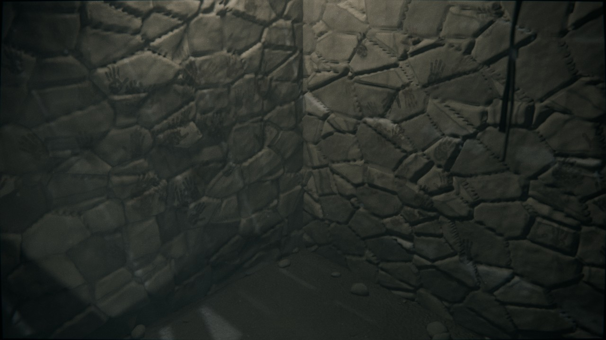
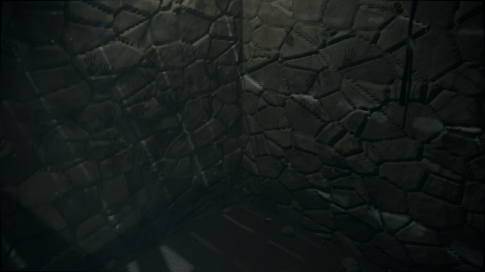
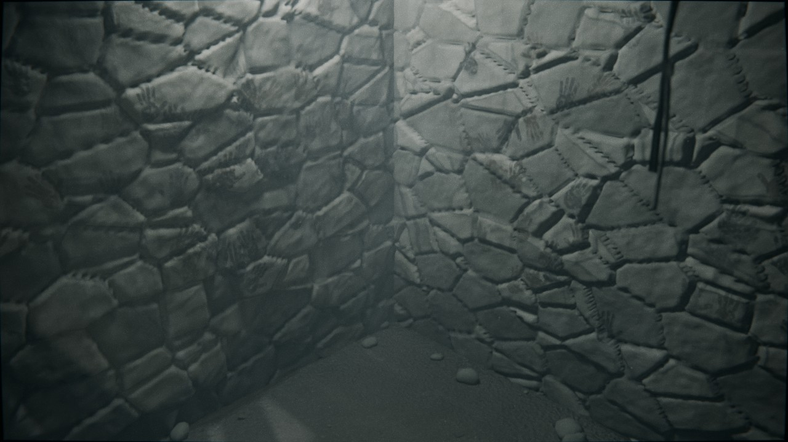

# 01 — Cave de Rustin Parr

**Jogo:** *Blair Witch Volume 1: Rustin Parr* (Terminal Reality, 2000)
**Época:** anos 90, a casa em ruína, como no final do filme *The Blair Witch Project*
**Look:** realista com película de 16 mm (grão, cor dessaturada, vinheta)

Cave de pedra húmida sob a casa de Parr. O soalho de cima está parcialmente
caído, a escada meio destruída e as paredes estão cheias de marcas de mãos
pequenas. **O canto fica limpo**: é ali que o personagem se vira para a parede.



## Ficheiros

| Ficheiro | O que é |
|---|---|
| `cave_parr.blend` | Cenário completo, pronto a abrir (Blender **5.0** ou mais recente, testado no 5.0.1; o `build_scene.py` corre no 4.5 e no 5.x) |
| `build_scene.py` | Script que gera o `.blend` de raiz; permite mudar parâmetros e regenerar |
| `previews/` | Renders de pré-visualização (Cycles, 40 amostras, 1280 px) |

## Planos (câmaras)

| Câmara | Uso | Preview |
|---|---|---|
| `CAM_1_Fixa_Estilo_Jogo` | Plano fixo alto no canto, à moda das câmaras do jogo | `cam1_fixa_jogo.jpg` |
| `CAM_2_Costas_Para_Canto` | O plano principal: personagem de costas, virado para o canto | `cam2_costas_canto.jpg` |
| `CAM_3_Topo_Escada` | Do alto da escada a olhar para baixo: quem vai entrar | `cam3_topo_escada.jpg` |
| `CAM_4_Detalhe_Boneco` | Detalhe do boneco de paus no chão, com o luar e profundidade de campo | `cam4_detalhe_boneco.jpg` |
| `CAM_5_Fundo_Analise` | Plano calmo para fundo das análises, com espaço escuro à esquerda para texto | `cam5_fundo_analise.jpg` |

## Variantes de luz

Na coleção `04_VARIANTES`, ative **só uma** (pela caixa de exclusão no Outliner):

- `VAR_1_Normal`: lanterna estável e luz suave no canto.
- `VAR_2_Luz_a_Falhar`: a lanterna está fraca e cintila (animação de ruído na energia, frames 1–240).
- `VAR_3_Presenca`: o canto fica mais frio e intenso, com uma névoa a juntar-se nele.

| Luz a falhar | Presença |
|---|---|
|  |  |

## Pôr o personagem (FBX do Mixamo)

1. `File > Import > FBX` do avatar.
2. Escolha um marcador em `07_PERSONAGEM`:
   - `PERSONAGEM_1_Virado_Canto`: em pé, a olhar para o canto.
   - `PERSONAGEM_2_Fundo_Escada`: no fundo da escada, a entrar na cave.
   - `PERSONAGEM_3_Com_Lanterna`: a meio da cave, virado para a parede das mãos.
3. Copie a *Location* e a *Rotation* do marcador para o armature (painel `N > Item`).
   A seta do marcador aponta para onde o personagem olha, que é a frente `-Y`,
   a mesma do Mixamo.
4. As silhuetas em wireframe mostram a escala (1,75 m) e não aparecem no render.

**A lanterna na mão:** as luzes da lanterna são filhas do objeto `Lanterna_Mao`.
Para a pôr na mão, adicione ao `Lanterna_Mao` uma constraint *Child Of* com o
osso `mixamorig:RightHand` e ajuste a posição.

## Organização

```
01_AMBIENTE     paredes (deslocamento real), chão de terra, teto e soalho partido, escada, poço da porta
02_PROPS        banco tombado, prateleiras, mochila, lanterna, bonecos de paus, entulho, gravilha, folhas
03_LUZ_BASE     luar (entra pelos buracos do soalho) e luar pela porta entreaberta
04_VARIANTES    VAR_1_Normal / VAR_2_Luz_a_Falhar / VAR_3_Presenca
05_ATMOSFERA    nevoeiro volumétrico, poeira no ar, teias
06_CAMARAS      5 câmaras + alvo de foco
07_PERSONAGEM   3 marcadores com silhueta de referência
```

## Render

- **Cycles**, 512 amostras com denoise e 1920×1080: é o render final. Para testes rápidos
  baixe as amostras para 32–64.
- As paredes e o chão usam **deslocamento real** no material, que só se vê em
  Cycles. Em Eevee aparecem como relevo (bump).
- O look de 16 mm está no **Compositor**: halo, distorção de lente, dessaturação,
  grading (sombras frias e altas luzes quentes), vinheta e grão. Para o ver no viewport,
  ative o *Compositor* no modo *Rendered*.
- O *color management* é AgX com *Base Contrast* e exposição +0,6.

## Regenerar

```bash
# com o Blender instalado
blender -b -P build_scene.py -- --out cave_parr.blend
# com renders de pré-visualização
blender -b -P build_scene.py -- --out cave_parr.blend --render previews --samples 64
```

O script usa uma *seed* fixa, por isso gera sempre o mesmo cenário. Mude `SEED` no
topo do ficheiro para obter outra disposição de pedras, marcas de mãos e entulho.
