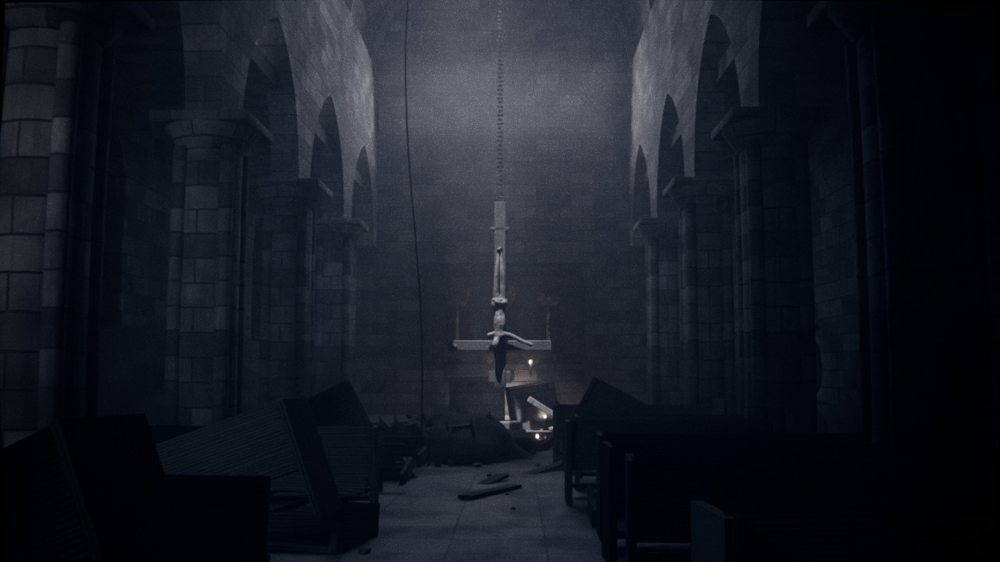

# 02 — Igreja gótica soterrada

**Vídeo:** *Messiah* (Shiny Entertainment, 2000). Não é uma correlação direta com o jogo,
mas o tema é o mesmo: o sagrado profanado.
**Inspiração:** a igreja enterrada de *Exorcist: The Beginning* (2004)
**Look:** noir, quase monocromático, com pretos profundos e grão pesado. As velas são o único acento quente.

Uma igreja gótica enterrada, descoberta por escavação. O luar entra por um buraco
aberto na abóbada e cai como um holofote sobre a **cruz invertida**, arrancada do
altar e pendurada por uma corrente mesmo em frente a ele. Há bancos virados, santos
decapitados, terra a escorrer pelas janelas, e um fresco com os olhos dos santos arrancados.



## Ficheiros

| Ficheiro | O que é |
|---|---|
| `igreja_soterrada.blend` | Cenário completo (Blender **4.5 LTS** ou mais recente) |
| `build_scene.py` | Gera o `.blend` de raiz |
| `previews/` | Renders de pré-visualização (Cycles, 40 amostras, 1280 px) |

## Planos

| Câmara | Uso |
|---|---|
| `CAM_1_Entrada_Nave` | O plano "descoberta": o corredor central até à cruz no feixe de luar |
| `CAM_2_Contrapicado_Cruz` | De baixo, com a cruz, a corrente e o buraco na abóbada |
| `CAM_3_Personagem_Costas` | O personagem no corredor, de costas, a olhar para a cruz (focado no marcador) |
| `CAM_4_Detalhe_Fresco` | O fresco dos santos com os olhos arrancados, à luz das velas |
| `CAM_5_Fundo_Analise` | Plano calmo para fundo das análises, com a cruz à direita e espaço escuro à esquerda |
| `CAM_6_Alto_Flutuante` | Vista alta, a pairar junto à abóbada, como o Bob antes de possuir alguém |

## Variantes de luz (`05_VARIANTES`: ative só uma)

- `VAR_1_Normal`: o luar e as velas acesas.
- `VAR_2_So_Luar`: as velas apagadas. Fica só o feixe de luar, que é o noir mais puro.
- `VAR_3_Nuvens`: com as velas acesas, o luar pulsa como se passassem nuvens (animado, frames 1–240).

## A cruz

- Está em `04_CRUZ`. Tudo depende do `CRUZ_Pivot_Corrente`, preso à nervura da abóbada.
- **Balança devagar**: o pivot tem ruído animado na rotação. Numa imagem parada, escolha o frame que preferir.
- **Para trocar o Cristo** por uma figura sua: esconda `Cristo_Madeira_Partido` e
  `Cristo_Perizonio_Mao` e ponha a figura como filha de `Cruz_Invertida`, no lugar de
  `MARCADOR_Cristo_Substituir`.
- O Cristo é feito com um esqueleto e o modificador *Skin*. Pode mudar a pose
  movendo os vértices do esqueleto em *Edit Mode*.

## Personagem (FBX do Mixamo)

Os marcadores estão em `08_PERSONAGEM`. A seta mostra para onde o personagem olha
(frente `-Y`, como no Mixamo), e a propriedade `nota` descreve a pose pensada:

- `PERSONAGEM_1_Corredor_Olha_Cruz`: de pé no corredor, é o plano da `CAM_3`.
- `PERSONAGEM_2_Ajoelhado_Cruz`: ajoelhado diante da cruz.
- `PERSONAGEM_3_Entrada`: a entrar na nave.
- `PERSONAGEM_4_Sob_O_Buraco`: acabou de descer pela corda.

Copie a *Location* e a *Rotation* do marcador para o armature. As silhuetas não aparecem no render.

## Render

- Cycles, 512 amostras com denoise e 1920×1080.
- O look noir está no Compositor: halo nas velas, distorção de lente, saturação a 32 %,
  sombras frias, vinheta forte e grão.
- As luzes auxiliares estão em `06_ATMOSFERA` e não aparecem na câmara:
  - `LUZ_Preenchimento_Ceu`: a luz do céu que entra pelo buraco;
  - `LUZ_Rasante_Colunas`: o recorte das colunas do lado esquerdo;
  - `LUZ_Recorte_Fundo`: o contraluz no fundo da nave.

  Baixe-as para um noir ainda mais negro.

## Regenerar

```bash
blender -b -P build_scene.py -- --out igreja_soterrada.blend
blender -b -P build_scene.py -- --out igreja_soterrada.blend --render previews --samples 64
```
