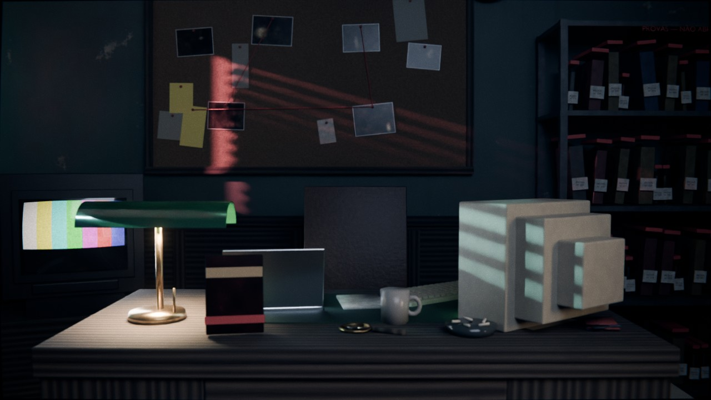

# 03 — Gabinete do investigador de software de horror

**A base do canal.** É o cenário fixo onde o avatar aparece em todos os vídeos.
**Estilo:** gabinete noir dos anos 90, de noite, com um portátil moderno no meio do retro.

Tem uma secretária de madeira com candeeiro de banqueiro, um monitor CRT bege e uma
TV CRT, e um quadro de provas com fotografias e fio vermelho. Na estante, jogos em
**sacos de prova etiquetados** ("PROVA Nº 001…"). As persianas cortam a luz néon da
rua em faixas ciano e vermelhas, e a porta tem vidro fosco com letras douradas.
No relógio, parado às 3:33.



## O que troca em cada vídeo

| O quê | Como |
|---|---|
| **Imagem/vídeo do jogo** no CRT da secretária **e** na TV | Substitua a imagem `ECRA_Jogo` (`Image > Replace…`). Aceita `.png`, `.jpg` ou vídeo `.mp4`. Num vídeo, no nó *Image Texture* do material `M_Ecra_CRT_Jogo`, ative *Auto Refresh* e indique o número de frames. O efeito de CRT (curvatura, scanlines e vinheta) é aplicado automaticamente. |
| **6 fotografias do quadro de provas** | Substitua as imagens `FOTO_Prova_1` … `FOTO_Prova_6`. |
| **Capa do "caso atual"** (a caixa em pé na secretária, virada para a câmara) | Substitua a imagem `CAPA_Caso_Atual`. |
| **Letras da porta** | Edite `Porta_Letras_0` e `Porta_Letras_1` (`Tab` para editar o texto). Por omissão dizem "INVESTIGAÇÃO / SOFTWARE DE HORROR". Pode pôr o nome do canal. |

## Planos

| Câmara | Uso |
|---|---|
| `CAM_1_Frente_Apresentador` | **Tu de frente**, sentado à secretária a falar para a câmara |
| `CAM_2_Lado_Perfil` | **Tu de perfil**, virado para o computador, com a janela e as persianas atrás |
| `CAM_3_Plano_Geral` | O gabinete inteiro (abertura e transições) |
| `CAM_4_Insert_Ecra_CRT` | O ecrã do CRT em grande, para mostrar o jogo |
| `CAM_5_Insert_Quadro` | O quadro de provas |
| `CAM_6_Insert_Provas` | A estante dos jogos em sacos de prova |
| `CAM_7_Por_Cima_Ombro` | Por cima do ombro, para o CRT e o teclado |
| `CAM_8_TV_Fundo_Analise` | A TV CRT com o jogo, como fundo das análises |

## Personagem

Os marcadores estão em `06_PERSONAGEM`. Ambos estão na cadeira; a silhueta sentada serve de referência.
- `PERSONAGEM_1_Sentado_Frente`: virado para a `CAM_1`. Use uma animação sentada do
  Mixamo (por exemplo *Sitting Talking*).
- `PERSONAGEM_2_Sentado_Ao_Computador`: virado para o CRT, para a `CAM_2` (por exemplo *Typing*).

Copie a *Location* e a *Rotation* do marcador para o armature. A frente do marcador é `-Y`, como no Mixamo.

## Variantes (`04_VARIANTES`: ative só uma)

- `VAR_1_Noite_Normal`: candeeiro aceso, ecrãs ligados e néon da rua.
- `VAR_2_So_Ecras`: candeeiro apagado. Só os ecrãs e o néon, o que dá um ambiente mais inquietante.
- `VAR_3_Relampago`: relâmpagos pela janela nos frames 61 e 151.

## Render

- Cycles, 384 amostras com denoise e 1920×1080. **Não usa nevoeiro volumétrico**, por isso renderiza depressa.
- **A janela é barata**: a rua é uma imagem emissiva que só a câmara vê, e as faixas
  de luz vêm de dois focos (`LUZ_Neon_Rua_Ciano` e `LUZ_Neon_Rua_Vermelho`) a atravessar as persianas.
- A ventoinha do teto roda sozinha, em loop.
- No Compositor: halo nos ecrãs, distorção de lente leve, vinheta e grão.

## Regenerar

```bash
blender -b -P build_scene.py -- --out gabinete_investigador.blend
blender -b -P build_scene.py -- --out gabinete_investigador.blend --render previews --samples 64
```
