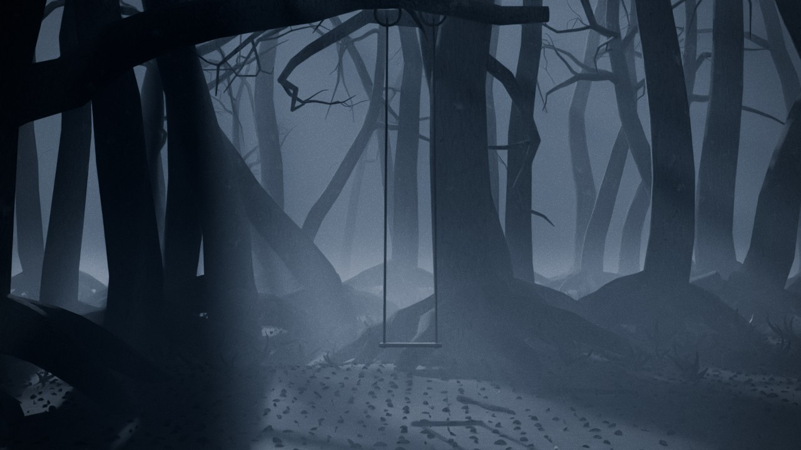

# 04 — Floresta enevoada e a clareira

**Vibe:** está tudo calmo, mas há algo errado. É uma floresta densa de árvores altas e
tortas, com raízes à mostra, e névoa volumétrica colada ao chão. Numa clareira há
**objetos humanos que não deviam estar ali**.
**Versões:** noite (luar frio, baixo, por trás da clareira) e dia (céu encoberto, luz
chapada e nevoeiro branco, que é igualmente inquietante).



## Ficheiros

| Ficheiro | O que é |
|---|---|
| `floresta_enevoada.blend` | Cenário completo (Blender **5.0** ou mais recente, testado no 5.0.1; o `build_scene.py` corre no 4.5 e no 5.x) |
| `build_scene.py` | Gera o `.blend` de raiz |
| `previews/` | Renders de pré-visualização (Cycles, 40 amostras, 1280 px, frame 90) |

## Os objetos fora de lugar (`04_OBJETOS`)

Ligue um, dois ou os três, pela caixa de exclusão no Outliner:

- `OBJ_1_Balanco`: um balanço vazio pendurado do ramo da árvore da clareira.
  **Baloiça sozinho**, muito devagar, sem vento que o justifique (frames 1–240).
- `OBJ_2_Cadeira`: uma cadeira de madeira velha, virada para a floresta, de costas para quem chega.
- `OBJ_3_Lanterna`: uma lanterna de petróleo apagada, pousada no chão, com o vidro enegrecido.

## Noite e dia

1. Em `05_LUZ`, ative **só uma** das coleções: `VAR_Noite` ou `VAR_Dia`.
2. Em *World Properties*, escolha o mundo correspondente: `Mundo_Noite` ou `Mundo_Dia_Encoberto`.
3. Exposição recomendada (*Render > Color Management*): **noite 1.0** e **dia 0.0**.

Cada versão tem a sua névoa (`ATMOS_Nevoa_Noite` e `ATMOS_Nevoa_Dia`). A densidade
ajusta-se no material (nó *Multiply Add*: o 2.º valor é a névoa rente ao chão, o 3.º é a neblina geral).

## Planos

| Câmara | Uso |
|---|---|
| `CAM_1_Chegada_Clareira` | Chegada à clareira: o balanço sob o ramo, em silhueta contra o nevoeiro |
| `CAM_2_Balanco_Perto` | O balanço mais perto |
| `CAM_3_Floresta_Profunda` | Troncos a perderem-se no nevoeiro, bom para fundo das análises |
| `CAM_4_Raizes_Rente_Chao` | Rente ao chão, com as raízes da árvore da clareira |
| `CAM_5_Alto_Observador` | Visto de cima, como se algo estivesse a observar da árvore |
| `CAM_6_Cadeira_Costas` | A cadeira de costas, virada para a escuridão |
| `CAM_7_Lanterna_Detalhe` | A lanterna apagada, de perto |

## Animação (frames 1–240)

- **Névoa** a derivar devagar (keyframes no nó `Deriva_Nevoa` dos materiais de névoa).
- **Folhas secas a cair**: partículas no `Emissor_Folhas_A_Cair`, empurradas pelo
  vento `VENTO_Brisa`. No viewport, reproduza a animação desde o início para a
  simulação ser calculada. Começa no frame −300, por isso já há folhas no ar no frame 1.
- **Brisa nos fetos**: modificador *Wave* nos modelos de feto.
- **O balanço a baloiçar sozinho.**

## Personagem

Os marcadores estão em `07_PERSONAGEM`. A seta mostra para onde o personagem olha
(frente `-Y`, como no Mixamo), e a propriedade `nota` descreve a pose:

- `PERSONAGEM_1_Beira_Clareira`: parado à entrada, a olhar para o balanço (plano da `CAM_1`).
- `PERSONAGEM_2_Entre_Arvores`: a chegar por entre as árvores.
- `PERSONAGEM_3_Junto_Cadeira`: ao lado da cadeira, sem se sentar.

## Notas técnicas

- As árvores são curvas com raio por ponto: 7 modelos na coleção `_MODELOS` (excluída do
  render), instanciados cerca de 170 vezes. A árvore da clareira é única.
- O chão tem folhas secas (cerca de 110 mil instâncias) e tufos de fetos, feitos com
  partículas *hair*, com densidade controlada por grupos de vértices.
- Cycles, 384 amostras com denoise. A névoa volumétrica é o que mais pesa: para testes, suba
  *Volume Step Rate* (em *Render > Volumes*) para 3–4.

## Regenerar

```bash
blender -b -P build_scene.py -- --out floresta_enevoada.blend
blender -b -P build_scene.py -- --out floresta_enevoada.blend --render previews --samples 64
```
