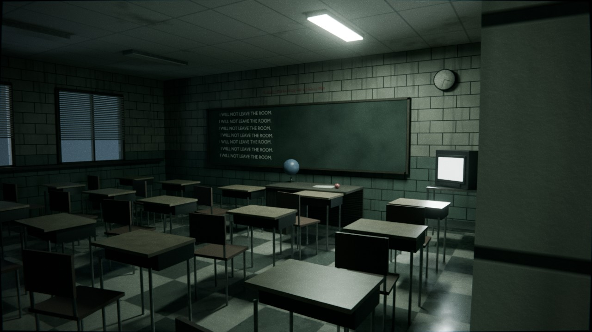
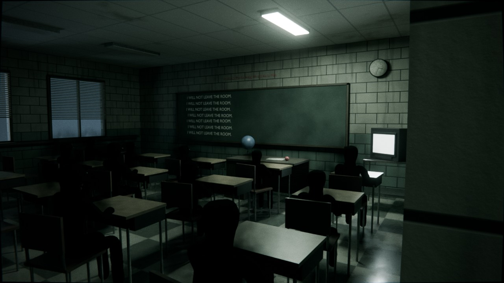
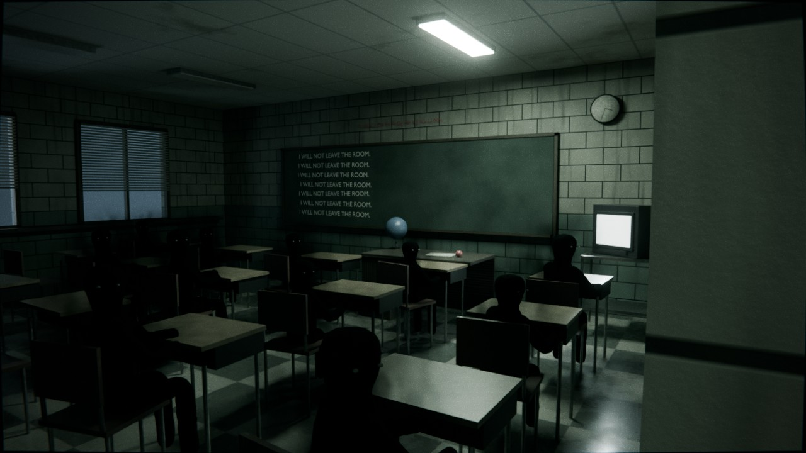

# 05 — Escola: o corredor e a sala de aula

**Vibe:** uma escola americana à noite. É um corredor comprido de cacifos, com
fluorescentes a falhar e o fundo engolido pelo escuro, só com o **EXIT** verde. Há três
portas: duas fechadas (numa delas, **uma mão pequena encostada ao vidro, por dentro**)
e uma aberta, que deixa sair a luz fria de uma sala de aula.

Na sala há uma **sequência**:

| Estado | O que se vê |
|---|---|
| **A: vazia** | Carteiras, cadeiras afastadas (uma caída), a TV com estática e, no quadro, *"I WILL NOT LEAVE THE ROOM."* repetido |
| **B: os vultos** | Vultos negros de crianças, sentados nas carteiras, **virados para o quadro**, com fumo negro a desfazer-lhes as bordas |
| **C: viraram-se** | Os mesmos vultos, **com a cabeça virada para a porta**, para quem está a olhar |

| A | B | C |
|---|---|---|
|  |  |  |

## A sequência animada (frames 1–240)

| Frames | O que acontece |
|---|---|
| 1–100 | A: sala vazia (a fluorescente da sala vai piscando) |
| 101–105 | **a luz da sala apaga** |
| 106–172 | B: os vultos estão lá, virados para o quadro |
| 173–177 | **a luz apaga outra vez** |
| 178–240 | C: os vultos viraram a cabeça para a porta |

A visibilidade dos vultos está animada (`hide_render` / `hide_viewport`) e sincronizada
com a fluorescente da sala. Para mudar os tempos, altere `SEQ` no topo do `build_scene.py` e regenere.

**À mão:** as coleções `04_VULTOS/VULTOS_B_Virados_Quadro` e `VULTOS_C_Virados_Porta`
também ligam e desligam cada estado. Para uma imagem fixa, escolha um frame dentro do
intervalo do estado, ou apague os keyframes de visibilidade.

## Os vultos

- São feitos com um esqueleto e o modificador *Skin*: 16 crianças sentadas, com tamanhos ligeiramente diferentes.
- O material é negro absoluto e fosco. À volta de cada um há um volume de **fumo negro** animado.
- Têm **dois pontos quase impercetíveis onde seriam os olhos**, que só apanham a luz.
  É o que faz ler a direção da cabeça no estado C. No estado C, o tronco também roda um pouco para a porta.

## Planos

| Câmara | Uso | Frame sugerido |
|---|---|---|
| `CAM_1_Corredor` | O corredor inteiro até ao EXIT | qualquer |
| `CAM_2_Aproximacao_Porta` | A caminhar para a porta aberta | qualquer |
| `CAM_3_Umbral_Sala` | **O plano da sequência**, da porta para dentro da sala | 60 / 150 / 210 |
| `CAM_4_Fundo_Sala` | Do fundo da sala, com as costas dos vultos e o quadro | 150 |
| `CAM_5_Secretaria_Professora` | Da secretária para os alunos | 210 |
| `CAM_6_Quadro_Giz` | A frase no quadro | qualquer |
| `CAM_7_Vidro_Porta_103` | A mão atrás do vidro da porta fechada | qualquer |
| `CAM_8_Cacifo_Aberto` | O cacifo entreaberto, com a manga de um casaco a sair | qualquer |

## Personagem

Marcadores em `07_PERSONAGEM`:
- `PERSONAGEM_1_Corredor`: a caminhar pelo corredor.
- `PERSONAGEM_2_A_Porta`: parado à porta aberta, a olhar para dentro.
- `PERSONAGEM_3_Dentro_Sala`: acabou de entrar.

## Editar

- **Frase do quadro:** objetos `Giz_Linha_0` a `Giz_Linha_6` (`Tab`).
- **Luzes:** `05_LUZES`. As fluorescentes do corredor são `LUZ_Corredor_*`. A de 8 m pisca;
  a partir dos 20 m estão apagadas.

## Regenerar

```bash
blender -b -P build_scene.py -- --out escola_corredor_sala.blend
blender -b -P build_scene.py -- --out escola_corredor_sala.blend --render previews --samples 64
```
