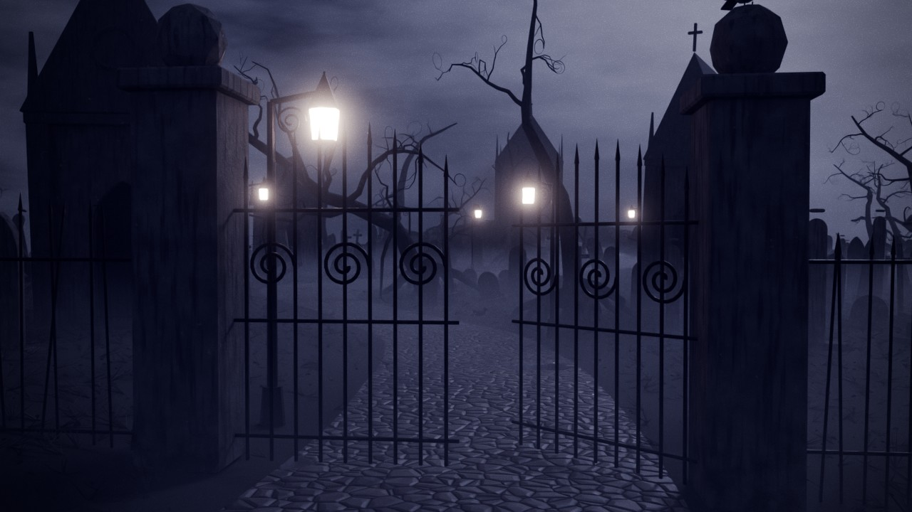

# 06 — Cemitério gótico e decadente (estilo Tim Burton)

**Vibe:** um cemitério à *Noiva Cadáver* ou *Sleepy Hollow*, com 70 × 70 m. As formas são
exageradas e alongadas, as campas estão todas tortas, os mausoléus têm telhados
agudíssimos, as árvores são negras e escanzeladas, com ramos em espiral, e há corvos.
O céu está **nublado, com o luar pálido escondido atrás das nuvens**, e o único calor vem
de meia dúzia de candeeiros vitorianos.
**Versões:** noite e dia (céu encoberto branco-cinza). Ambas são inquietantes.



## O que tem

- **Portão de ferro forjado com espirais**, com uma das folhas entreaberta, pilares de pedra e uma
  **vedação de lanças** a toda a largura, com barras tortas e em falta.
- **Estrada de calçada em S**, com musgo e poças, a subir do portão até à colina.
- **Mausoléu principal** no alto da colina, com pináculo, pináculos nos cantos, óculo
  e porta de grade entreaberta, mais **4 mausoléus** estreitos e altos, ligeiramente inclinados.
- **Cerca de 350 campas**, de 8 modelos (arredondada, gótica, cruz, cruz celta, obelisco,
  lápide estreita com voluta, partida e laje), instanciadas, **tortas, afundadas e alongadas**.
- **Estátuas**: 2 anjos chorões, com as mãos na cara e as asas abertas, e 2 figuras
  encapuzadas sem rosto.
- **8 candeeiros vitorianos** ao longo da estrada: acesos, **um a piscar**, um fraco,
  **um morto** e **um tombado**.
- **Árvores Burton**, negras e com pontas em espiral, mais uma **árvore retorcida na colina**.
- **Corvos** no portão, na figura encapuzada, no pedestal do anjo e na estrada.
- Erva seca, folhas mortas e **nevoeiro baixo** entre as campas.

## Noite e dia

1. Em `05_LUZ`, ative **só uma** das coleções: `VAR_Noite` ou `VAR_Dia`.
2. Em *World Properties*, escolha `Ceu_Noite_Nublado` ou `Ceu_Dia_Encoberto`.
3. Exposição recomendada: **noite 1.3** e **dia 0.0**.

As luzes dos candeeiros estão na `VAR_Noite`. De dia não iluminam; só o vidro fica com um brilho ténue.
O céu não tem lua desenhada: há só uma zona mais clara nas nuvens, na direção do luar.

## Planos

| Câmara | Uso |
|---|---|
| `CAM_1_Portao` | À entrada, pelo portão entreaberto, com a estrada a perder-se no nevoeiro |
| `CAM_2_Estrada_Candeeiros` | A estrada em S com os candeeiros, e os mausoléus ao fundo |
| `CAM_3_Mausoleu_Principal` | Contrapicado do mausoléu principal contra o céu |
| `CAM_4_Campas_Tortas` | Rente ao chão, entre as campas e cruzes tortas |
| `CAM_5_Anjo_Choroso` | O anjo chorão, com as asas abertas contra as nuvens |
| `CAM_6_Colina_Silhueta` | O postal Burton: a colina, a árvore e o mausoléu em silhueta |
| `CAM_7_Fundo_Analise` | Plano calmo, bom para fundo das análises |

## Personagem

Marcadores em `07_PERSONAGEM`:
- `PERSONAGEM_1_Portao`: a entrar pelo portão.
- `PERSONAGEM_2_Estrada`: a caminhar pela estrada.
- `PERSONAGEM_3_Porta_Mausoleu`: diante da porta do mausoléu principal.

## Notas técnicas

- As campas e as árvores são instâncias de coleções em `_MODELOS` (excluída do render).
  Para mudar todas as campas de um tipo, edite o modelo.
- A estrada segue a curva definida em `ROAD_CTRL`, no topo do `build_scene.py`. As campas,
  as árvores e a erva evitam-na automaticamente.
- Cycles, 384 amostras com denoise. Para testes, suba *Volume Step Rate* para 3–4.

## Regenerar

```bash
blender -b -P build_scene.py -- --out cemiterio_gotico.blend
blender -b -P build_scene.py -- --out cemiterio_gotico.blend --render previews --samples 64
```
