# 08 — Inferno: fogo e gelo (estilo Tim Burton)

**Vibe:** uma descida pelos círculos do Inferno de Dante, vista por Tim Burton. Tudo é alongado,
torto e enrolado em espirais. O cenário base é cinza e basalto negro, dessaturado como os
outros; o calor vem **de baixo**, das fendas de lava, do rio e do abismo. As silhuetas negras
recortam-se contra um céu de fumo iluminado por baixo.
**Versões:** **Brasas** e **Gelo** (o Cocito, o círculo mais fundo, gelado). A geometria é a mesma
nas duas e ambas são inquietantes.

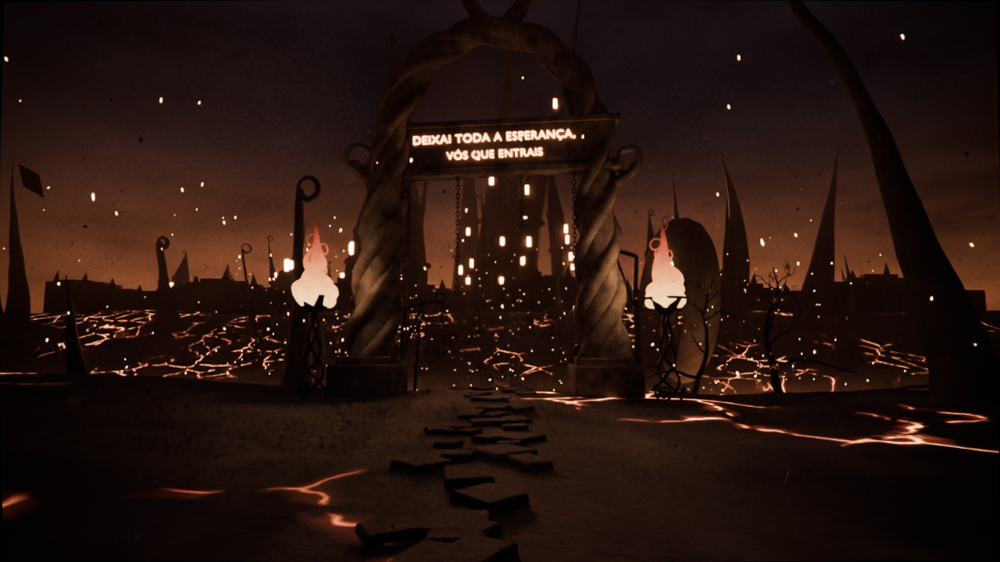

## O que tem

- **Portas do Inferno**: um arco ogival de 13 m, torto, feito de três cordões de pedra
  entrançados, com cornos em espiral no topo e nos ombros. A inscrição gravada a fogo diz
  **"DEIXAI TODA A ESPERANÇA, VÓS QUE ENTRAIS"**. Tem correntes penduradas do lintel e
  **dois braseiros** altos com pé em espiral.
- **A descida**: um caminho de lajes entre **fendas de lava** e picos de rocha alongados. Pelo
  caminho há **3 forcas** com **gaiolas** em forma de cebola, um **relógio de pé meio enterrado,
  parado às 3:33**, e uma placa **"BEM-VINDO — pedimos desculpa pelo calor"**, derretida.
- **Rio Aqueronte**, com um **cais** de madeira e o **barco de Caronte**: estreito, com a proa enrolada
  numa voluta alta e uma **lanterna** acesa. **Caronte** é uma figura encapuzada altíssima, sem
  rosto, com a vara na mão.
- **O abismo**, com lava no fundo a 30 m, fumo a subir e uma **ponte de pedra estreita e
  torta**, sem guardas e com blocos em falta, apoiada num arco de rocha cheio de estalactites.
- **A colina em espiral**, uma homenagem a *O Estranho Mundo de Jack*, enrolada por cima do abismo.
- **A Cidade de Dis** ao fundo: cerca de 45 torres agudíssimas e tortas, algumas com pontas em
  espiral, com **janelas-fornalha** e uma muralha com ameias tortas.
- **Árvores queimadas**, com as pontas dos ramos enroladas e brasas nas gretas, e **corvos de cinza**.
- **Atmosfera**: fumo ou névoa em volume, mais denso sobre o rio e a subir do abismo. Nas
  Brasas há **fagulhas** e **cinza a cair**; no Gelo, **neve**.

## Brasas e Gelo: um só interruptor

*Scene Properties → Custom Properties → **`gelo`***

| `gelo` | Versão | O que muda |
|---|---|---|
| **0** | **Brasas** | Lava incandescente, fendas em brasa, fumo avermelhado, fagulhas e cinza, braseiros acesos, janelas de Dis em fogo |
| **1** | **Gelo** | Lava apagada e gelada (com fendas azuis), geada em tudo o que está virado para cima, névoa azul, neve, **sincelos** no lintel, na ponte, na colina e no relógio, e **chamas congeladas** nos braseiros |

O valor muda **materiais, céu, nevoeiro, partículas e luzes de uma vez**: todos leem a
propriedade através de um nó *Attribute* do tipo *View Layer*. Não há drivers nem scripts.
Pode até animá-lo, por exemplo para o inferno gelar a meio de um plano.

Na versão Gelo, **o único calor é a lanterna de Caronte**, como pede o guia de estilo.

**Para renderizar mais depressa**, exclua a coleção de luzes da versão que não está a usar
(`05_LUZ/VAR_Brasas` ou `05_LUZ/VAR_Gelo`). O ficheiro abre com a `VAR_Gelo` excluída.
Ao mudar para o Gelo, inclua a `VAR_Gelo` e exclua a `VAR_Brasas`.
Exposição recomendada: **0.6** nas duas versões.

## Planos

| Câmara | Uso |
|---|---|
| `CAM_1_Portas` | O plano de abertura: o caminho até às Portas, com Dis ao fundo, entre os braseiros |
| `CAM_2_Contrapicado_Inscricao` | Contrapicado das Portas e da inscrição |
| `CAM_3_Barco_Caronte` | Da margem: o cais, o barco e Caronte à espera |
| `CAM_4_Ponte_Abismo` | Suspensa sobre o abismo: a ponte de lado, a lava lá em baixo e a colina em espiral atrás |
| `CAM_5_Dis_Silhueta` | O postal Burton: Dis e os picos em silhueta contra o céu |
| `CAM_6_Fendas_Relogio` | Rente ao chão: as fendas, o relógio parado às 3:33 e uma gaiola |
| `CAM_7_Fundo_Analise` | Plano largo e calmo, bom para fundo das análises |

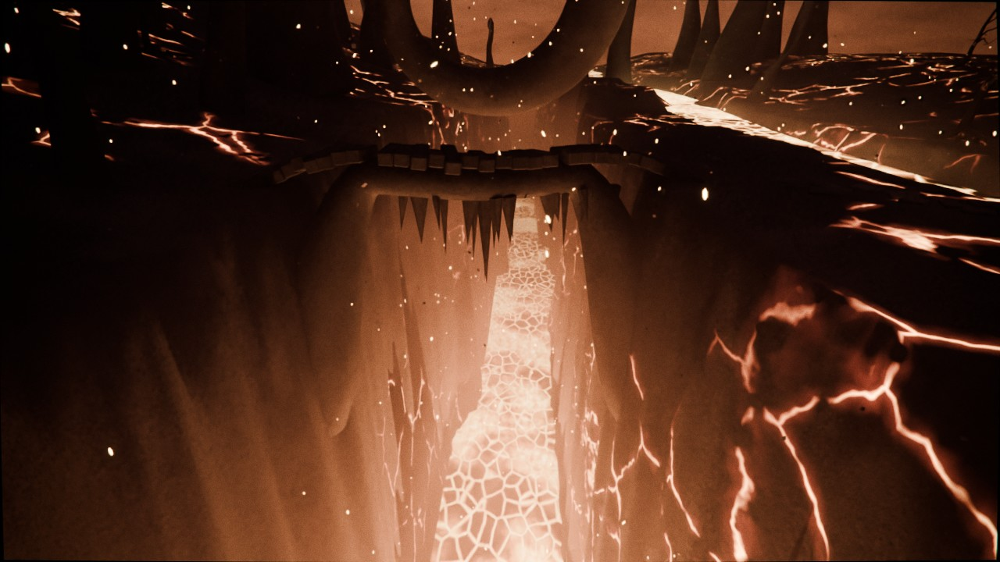
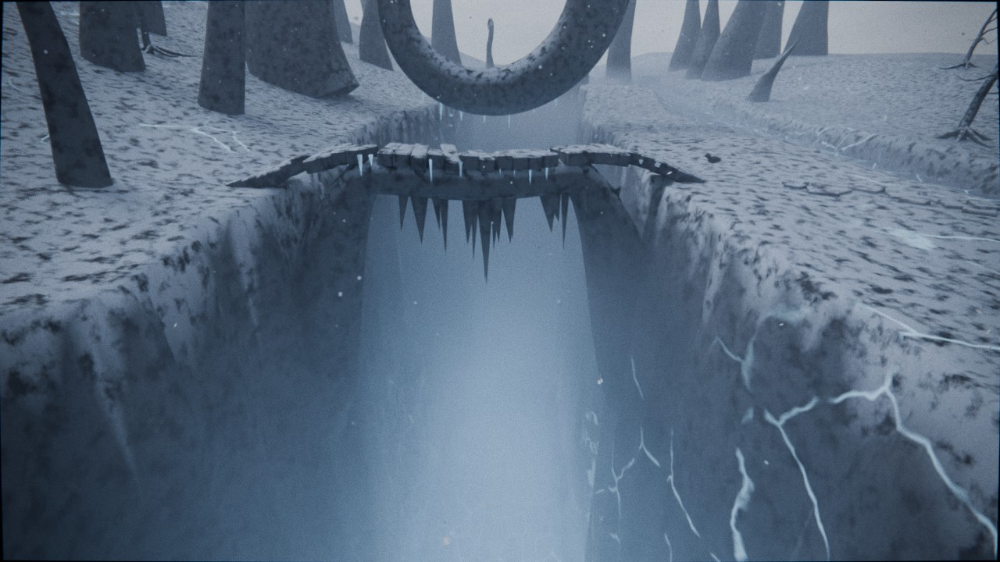

## Personagem

Marcadores em `07_PERSONAGEM`:
- `PERSONAGEM_1_Portas`: diante das Portas, a ler a inscrição.
- `PERSONAGEM_2_Cais`: no fim do cais, à espera de Caronte.
- `PERSONAGEM_3_Ponte`: a meio da ponte sobre o abismo.
- `PERSONAGEM_4_Preso_no_Gelo`: **versão Gelo**, preso no rio gelado. Baixe o personagem
  cerca de 1,1 m para ficar com o gelo pelo peito.

## Notas técnicas

- O terreno segue `ground_height()`, no topo do `build_scene.py`: a descida das portas até ao rio,
  o canal do rio (`river_y`), o abismo (`abyss_y`, `abyss_hw`) e a subida para Dis. O caminho
  segue `PATH_CTRL` e `PATH2_CTRL`, e os picos e as árvores evitam-no automaticamente.
- Os sincelos, as fagulhas, a cinza e a neve ficam **transparentes** na versão em que não
  existem, através do mesmo interruptor `gelo`.
- As árvores são instâncias de coleções em `_MODELOS` (excluída do render).
- Cycles, 384 amostras com denoise. Para testes, suba *Volume Step Rate* para 3–4; o volume é o
  que mais pesa.

## Regenerar

```bash
blender -b -P build_scene.py -- --out inferno_fogo_gelo.blend
blender -b -P build_scene.py -- --out inferno_fogo_gelo.blend --render previews --samples 48
```

## Pré-visualizações

| Brasas | Gelo |
|---|---|
|  | 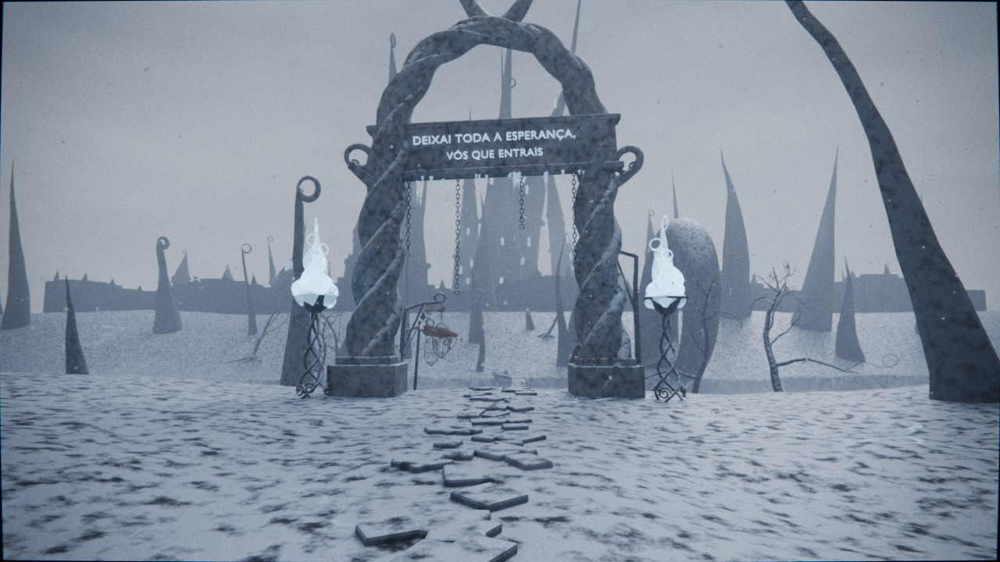 |
| 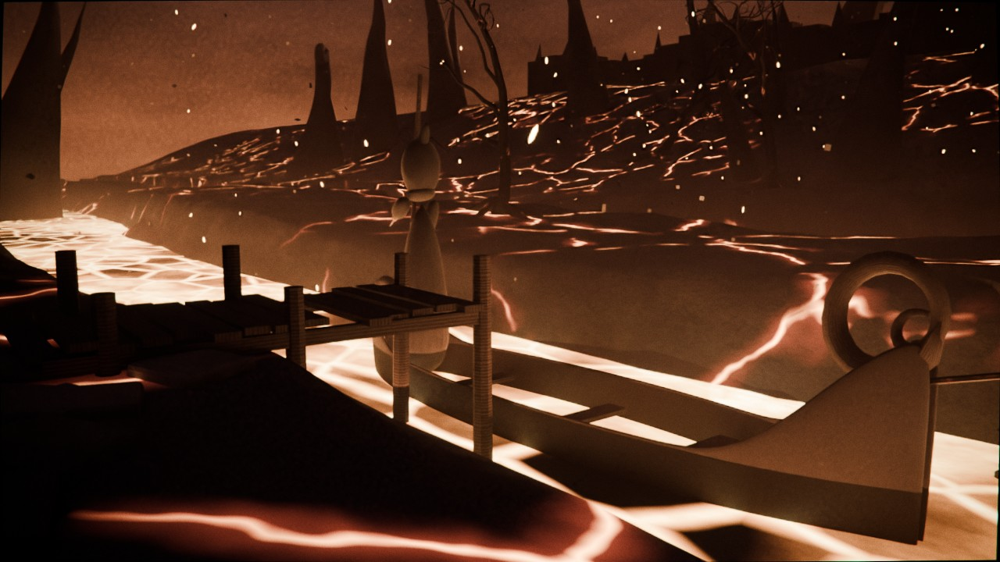 | 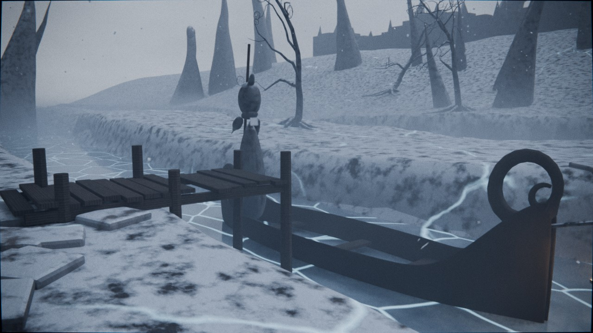 |
| 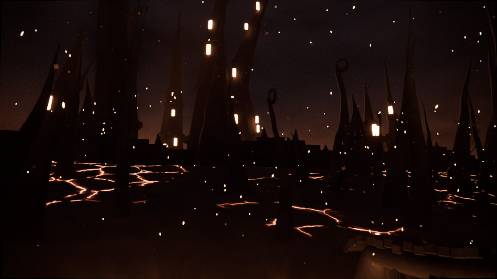 | 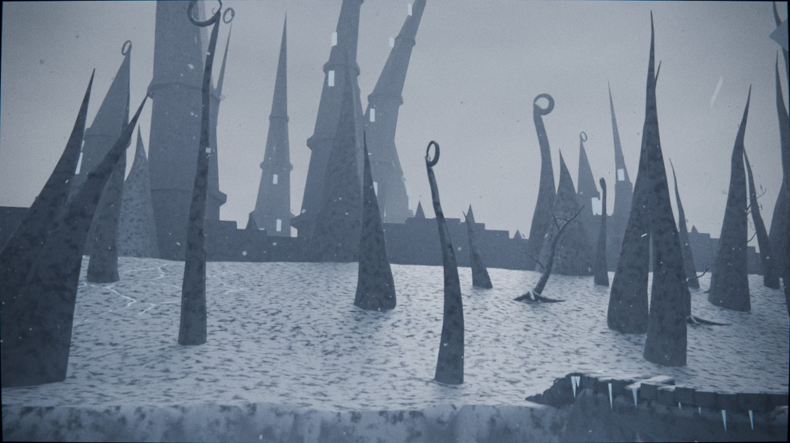 |
| 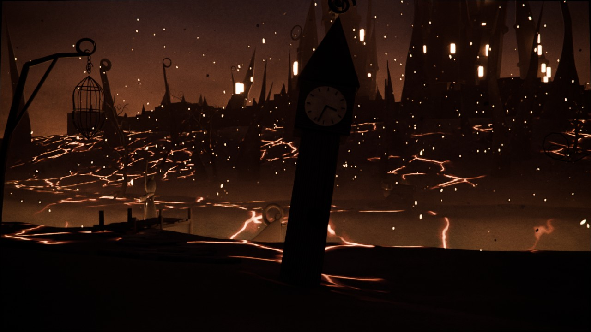 | 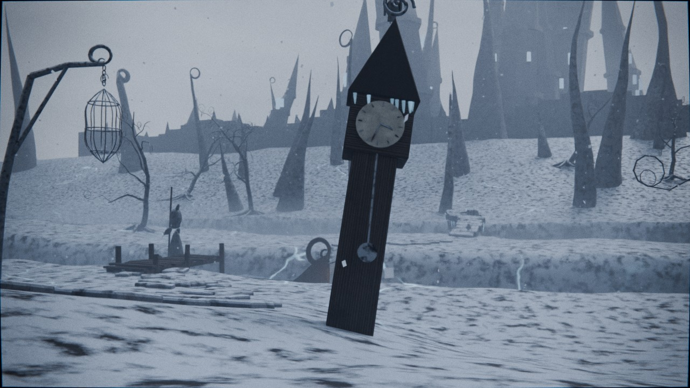 |
| 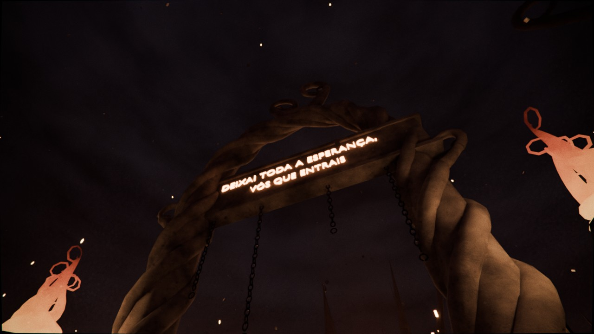 | 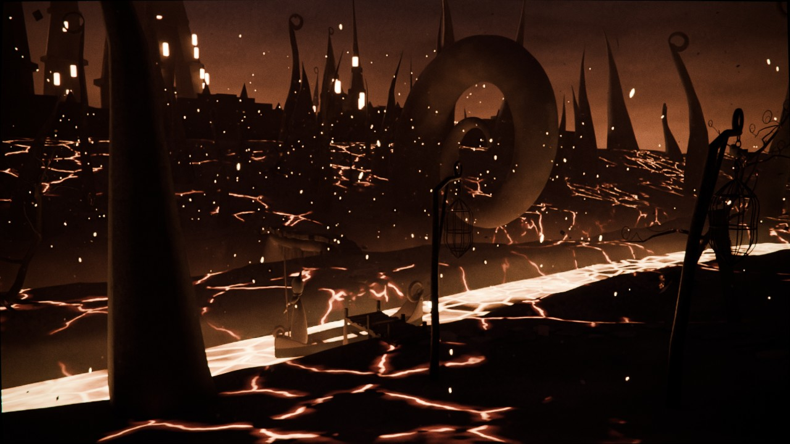 |
