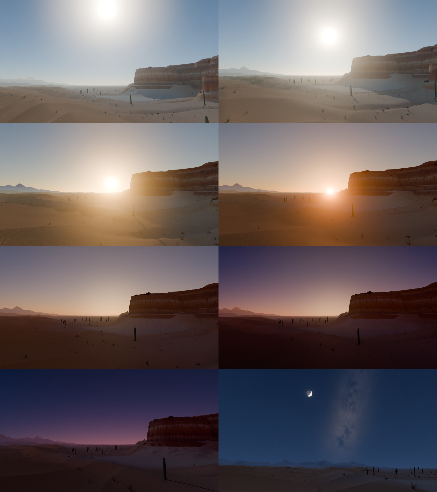
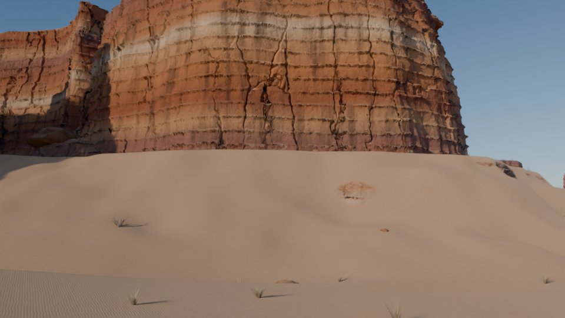

# Deserto: canyons, dunas e planícies (dia → crepúsculo → noite)

Cena procedural para **Blender 5.x + Cycles**, gerada inteiramente por um script Python
(`deserto_canyons.py`). Foi testada no Blender 5.0.1; no 5.2 deve funcionar igual.

- Terreno principal de **500 × 500 m** (malha de 0,5 m, ~1 M vértices), com terreno
  distante até 12 km para o horizonte.
- **960 frames @ 24 fps (40 s)**: dia abrasador → hora dourada → pôr do sol →
  crepúsculo civil, náutico e astronómico → noite com estrelas, Via Láctea e lua.
  O crepúsculo ocupa cerca de 45 % do tempo, para dar ênfase às transições.
- Travelling lento da câmara, das dunas para oés-sudoeste: o sol desce dentro do
  enquadramento até ao horizonte e, à noite, a câmara roda para sul, para a lua e
  a Via Láctea.

## Como usar

**No Blender (interface):** separador *Scripting* → *Open* → `deserto_canyons.py` → *Run Script*.
Demora cerca de 20 s. **Atenção: o script apaga a cena atual.**

**Linha de comandos:**

```bash
blender -b -P deserto_canyons.py -- --save deserto.blend   # gera e guarda
blender -b deserto.blend -a                                 # renderiza a animação para ./render/
```

## O que há na cena

| Elemento | Como é feito |
|---|---|
| Mesas e canyons (NO) | Planalto de ~50 m cortado por uma rede de canyons (ruído com domínio distorcido) e um canyon principal em meandros; paredes estratificadas em degraus |
| Buttes | 5 monólitos isolados na planície, com talude |
| Dunas (SE) | Dunas transversais com barlavento suave e face de avalanche íngreme, dunas secundárias e ondulações do vento (bump) |
| Planície | Bajada que sobe para as mesas, leitos de ribeira secos, pavimento de cascalho e uma *playa* de argila gretada |
| Pedras, arbustos, erva, cactos | Assets procedurais instanciados com Geometry Nodes (`Scatter_*`) |
| Céu | Grupo de nós `Ceu_Deserto`: Sky Texture (Multiple Scattering) + brilho crepuscular + auréola do sol + cinturão de Vénus / sombra da Terra + céu noturno + estrelas cintilantes + Via Láctea + lua com fase correta |
| Atmosfera | Volume de poeira junto ao solo (raios crepusculares), perspetiva aérea no material do terreno com a cor real do horizonte, e distorção do ar quente (só de dia) |
| Pós-produção | Bloom no compositor, AgX Punchy |
| Rochas com deslocamento real | As zonas rochosas estão numa malha própria (`Terreno_Rocha`) com subdivisão adaptativa do Cycles: estratos salientes, juntas verticais irregulares, blocos e erosão. O deslocamento vai a zero na fronteira com o resto do terreno (sem fissuras) |
| Texturas fotográficas | Rocha, areia e cascalho CC0 da [Poly Haven](https://polyhaven.com), projeção em caixa (sem UVs), normalizadas pela cor média para acrescentar grão e pormenor sem mudar as cores da cena |

## Texturas (Poly Haven)

Na primeira execução o script usa a API da Poly Haven para escolher e descarregar
(2k) uma textura de **rocha**, **areia** e **cascalho**, que ficam em cache em:

- `<pasta do .blend>/texturas/`, se o ficheiro já estiver guardado, ou
- `~/deserto_texturas/` (ou o caminho em `PASTA_TEXTURAS`).

Cada pasta (`rocha/`, `areia/`, `cascalho/`) inclui um `ORIGEM.txt` com o asset
usado. **Podes usar as tuas próprias texturas**: basta pôr na pasta ficheiros cujo nome
comece por `diff`/`albedo`/`color`, `rough` e `disp`/`height`. Para escolher outro asset,
apaga a pasta e define o id em `TEXTURAS_PREF` (p.ex. `"rocha": ["rock_face"]`).
Sem internet, o script avisa e mantém os materiais procedurais.

## Afinar

Tudo o que interessa está no bloco `CONFIG`, no topo do script:

- `SOL_ELEVACAO`: a curva de elevação do sol é o "relógio" da cena. Mudar os pontos
  muda o ritmo de todas as transições.
- `SOL_AZIMUTE`, `LUA_AZ_EL_*`, `VIA_NUCLEO`: posições no céu.
- `CAM_INI`, `CAM_FIM`, `CAM_OLHAR`: percurso e direção da câmara.
- `ESCALA_CEU`: força do céu face ao sol (mais baixo = sombras mais escuras e mais contraste).
- `AMOSTRAS`, `RES_X/RES_Y`, `USAR_VOLUME`, `USAR_CALOR`, `USAR_COMPOSITOR`.
- `N_PEDRAS`, `N_ARBUSTOS`, … : densidade do scatter.

Todos os valores animados (força e cor do sol, exposição, brilho do crepúsculo, estrelas,
poeira…) ficam gravados como keyframes a cada 8 frames. Podem ser editados depois no
Graph Editor: nós do grupo `Ceu_Deserto`, luz `Sol`, `Luar` e *Color Management → Exposure*.

## Tempos de render

Com volume e deslocamento, a 1920×1080 e 256 amostras (denoise OIDN), conte com cerca de
2 a 4 min por frame numa GPU recente (o deslocamento acrescenta ~50 % ao tempo e alguns GB
de memória). Se faltar memória, sobe `DESLOC_PIXEL` (p.ex. 3) ou `USAR_DESLOCAMENTO = False`. Para pré-visualizar: *Output → Resolution* a 50 % e 32 amostras,
ou `USAR_VOLUME = False` (o volume é o que mais pesa).

Orientação: +Y = Norte, +X = Este.

## Pré-visualização

Frames 1, 250, 400, 440, 480, 560, 660 e 960 (50 %, 24 amostras):



Plano de teste do butte com deslocamento real (materiais procedurais, sem as texturas):


