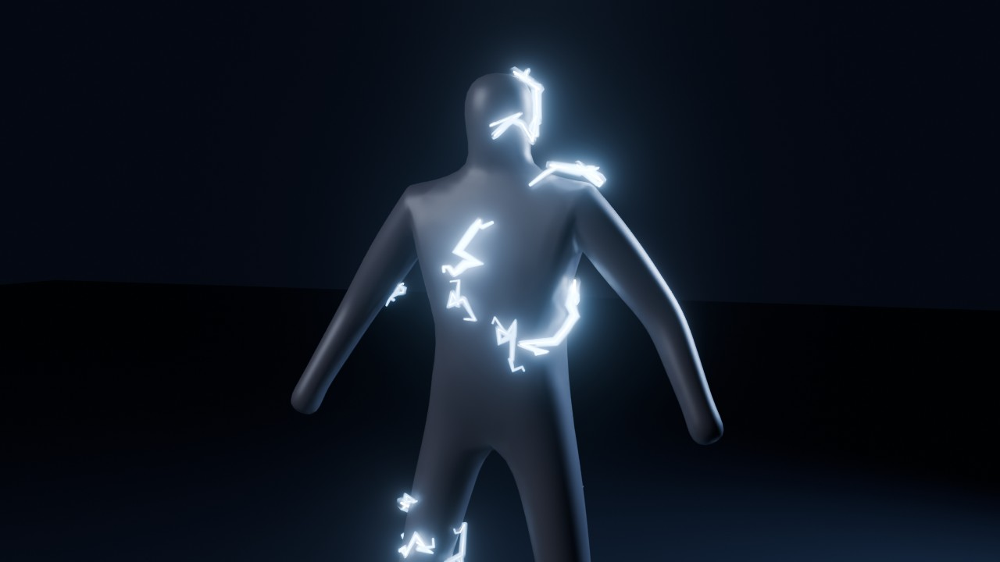

# Efeito 01 — Eletricidade SSJ (Dragon Ball Z)

**O que é:** raios elétricos que aparecem e desaparecem ao acaso e percorrem a **superfície do
avatar**, como no Super Saiyajin 2 (o Gohan contra o Cell). Os raios são finos, quebrados,
com um núcleo quase branco e um halo azul, e iluminam o corpo à volta.



Tudo é feito em **Geometry Nodes**, sem partículas a simular e sem cache. Por isso:
- o efeito **segue a pele** com o avatar animado (Mixamo, armature, shape keys);
- é **igual em cada render** (não muda entre o viewport e o render final);
- **um slider** controla tudo, de "quase nada" a "semi-permanente", e pode ter keyframes.

## Intensidade: de quase nada a semi-permanente

| Intensidade | Resultado | Preview |
|---|---|---|
| **0.05 – 0.15** | Quase nada: um raio solitário de vez em quando | [ver](previews/int_012_quase_nada.jpg) |
| **0.3 – 0.4** | Esporádico: alguns raios por segundo | [ver](previews/int_035_esporadico.jpg) |
| **0.6 – 0.7** | Carregado: o corpo crepita sem parar | [ver](previews/int_065_carregado.jpg) |
| **1.0** | Semi-permanente: o corpo está sempre coberto | [ver](previews/int_100_semi_permanente.jpg) |

A probabilidade de cada raio disparar é *Intensidade²*. Assim a parte de baixo do slider fica
mesmo subtil, e há muito controlo entre 0 e 0.3.

**Para animar** (por exemplo, a eletricidade a subir durante uma transformação), passe o rato
por cima do campo *Intensidade* no modificador e carregue em **I** para inserir um keyframe.
No `.blend` de demonstração, a Intensidade já está animada de 0 (frame 1) a 1 (frame 120).

## Como pôr no seu avatar

1. Abra o seu `.blend` com o avatar.
2. Selecione as **malhas** do avatar (corpo, e se quiser roupa e cabelo), não a armature.
3. Abra o separador **Scripting**, clique em **Open**, escolha `eletricidade_ssj.py` e depois
   **Run Script** (▶).
4. Cada malha recebe o modificador **"Eletricidade SSJ"** no fim da pilha (depois da
   *Armature*, como deve ser). Os controlos estão em *Modifier Properties* (a chave inglesa).

Também pode abrir o `eletricidade_ssj_demo.blend` e fazer *File → Append →
NodeTree → Eletricidade_SSJ*. Depois adicione um modificador *Geometry Nodes* ao avatar e
escolha esse grupo.

> Os controlos estão sempre em **metros reais**, mesmo que o avatar venha do Mixamo com
> escala 0.01: o efeito compensa a escala sozinho.

## Controlos

| Controlo | Para que serve |
|---|---|
| **Intensidade** | O principal: 0 = nada, 1 = semi-permanente |
| Densidade | Máximo de raios por m² de pele (o que aparece com Intensidade 1) |
| Faíscas | Faíscas pequenas à volta dos raios principais (0 = só raios grandes) |
| Comprimento | Tamanho de cada raio, em metros |
| Segmentos | Número de quebras do raio (mais = mais "partido") |
| Irregularidade | Quanto o raio ziguezagueia |
| Espessura / Halo | Grossura do núcleo branco e largura do brilho à volta |
| Afastamento | Distância à pele (aumente se os raios desaparecerem dentro da roupa) |
| **Duração** | Frames que cada raio dura antes de saltar para outro sítio (2–3 = estilo anime) |
| Cintilação | Variação de brilho de frame para frame |
| Cor / Brilho | Cor do halo (o núcleo é quase branco) e força da luz |
| Semente | Muda o padrão dos raios (cada malha já recebe uma diferente) |
| Mostrar Avatar | Desligue para ficar só com os raios (útil para compor em camadas) |

**Cores sugeridas:** azul SSJ2 `(0.25, 0.55, 1.0)` (o defeito), amarelo-dourado
`(1.0, 0.8, 0.2)`, roxo `(0.6, 0.3, 1.0)` ou vermelho `(1.0, 0.2, 0.1)`.

## Render

- **Cycles** dá o melhor resultado: os raios iluminam a pele à volta. Não projetam sombra.
- **EEVEE** também funciona. O halo usa transparência *Blended*.
- Para mais brilho, use o nó **Glare (Bloom)** no compositor. O `.blend` de demonstração
  já o tem configurado.
- Os raios que tentariam "saltar" o vão entre as pernas ou entre o braço e o tronco são
  descartados automaticamente, para não aparecerem linhas retas no ar.

## Ficheiros

```
eletricidade_ssj.py           o efeito (corre no Blender com o avatar selecionado)
build_demo.py                 gera o .blend de demonstração e as previews
eletricidade_ssj_demo.blend   manequim de demonstração com o efeito (Intensidade animada)
previews/                     renders de pré-visualização
```

Regenerar a demonstração:

```
blender -b -P build_demo.py -- --out eletricidade_ssj_demo.blend --render previews --samples 64
```

Testado no Blender 4.5. O script trata das diferenças de API do 5.x (sockets do
*Curve to Mesh*, do *Glare* e do compositor), mas ainda não foi testado nessa versão.
